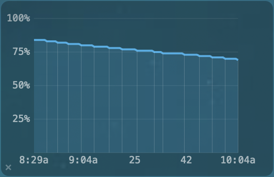

# BatteryGraph.spoon

A Hammerspoon Spoon that records and graphs battery percentage over time on your macOS desktop.



## Features

- **Live desktop widget** — polls `hs.battery` every 60s and draws a stepped line chart on the desktop
- **Stepped line (popup)** — the browser popup chart uses `stepped:'before'` mode: horizontal holds at each sampled value with vertical drops/gains (no diagonal interpolation)
- **Gap markers** — red vertical indicators show where time gaps (sleep, offline periods) occurred; adjacent gaps automatically merge into one marker
- **Change markers** — vertical lines at battery change events with auto-scaling density (`(changes/20)^1.3`)
- **Trim to discharge** — automatically cuts off previous charge cycles once the battery starts draining
- **Drag-to-select** — click and drag to see average battery change rate for any time range
- **Full-history popup** — click ◉ to open an interactive Chart.js graph in your browser with pan, zoom, and scroll
- **Disk persistence** — survives restarts via `data.json`
- **Configurable** — colors, sizes, position, polling interval, and more

## Widget Interactions

**Hover over the chart:**
- Shows **time and percentage** of the hovered data point at the top (e.g., `10:20am  64%`)
- Displays a **white vertical cursor line** at the hovered point's x-position
- Both disappear when the mouse leaves the chart area
- Hover handler is throttled to ~60fps to reduce GPU load from canvas property updates

**Drag across the chart:**
- Click and drag to select a time range
- A **light blue box** appears around the selected area (snapped to data points)
- **Vertical cursor lines** at both start and end positions, snapping to the nearest data point
- **Start → End point info** at the top: time and percentage of both endpoints
- **Average battery change rate** at the bottom: direction arrow, % change, duration, %/hour
- Must drag more than 3px to activate (preserves hover on tiny accidental drags)
- Selection stays visible after release; clears when you move the cursor beyond 4px from the release point or the mouse leaves the chart area

**Click near a red gap marker** (within ~4px):
- Shows **gap range** instead: start and end times with percentages on both sides
- Gap info persists while the cursor stays near the gap marker; reverts to normal hover when you move away

**Click "◉"** (top-right corner): opens the full-history popup in your browser

**Click "×"** (bottom-right corner):
- **Two-click confirmation**: first click arms it (2-second window), second click clears all data
- Records one fresh battery reading after clearing

## Full-History Popup

Click **◉** to open an interactive Chart.js graph in your default browser showing all recorded data.

| Gesture | Action |
|---|---|
| **Drag** | Pan chart horizontally |
| **Shift + drag** | Draw selection box → zoom on release |
| **Scroll** | Zoom in/out on x-axis |
| **Double-click** | Reset zoom to original view |

X-axis labels in 12-hour time format. Zoom limited to 1-minute minimum range. Chart starts fully zoomed out.

## Installation

```lua
hs.loadSpoon("BatteryGraph")
spoon.BatteryGraph:start()
```

Or via SpoonInstall:

```lua
spoon.SpoonInstall:andUse("BatteryGraph", {
    repo = "DoozyDak/BatteryGraph.spoon",
    start = true,
})
```

## Usage

In your `~/.hammerspoon/init.lua`:

```lua
hs.loadSpoon("BatteryGraph")
spoon.BatteryGraph.rightMargin = 20
spoon.BatteryGraph:start()
```

## Configuration

| Property | Default | Description |
|---|---|---|
| `position` | `{ x = 20, y = 300 }` | Canvas position (ignored if `rightMargin` set) |
| `rightMargin` | `nil` | Distance from right edge (overrides `position.x`) |
| `windowLevel` | `nil` | `"desktopIcon"`, `"normal"`, etc. |
| `width` / `height` | `280` / `180` | Canvas size |
| `backgroundColor` | `{ alpha = 0.3, white = 0 }` | Background fill |
| `backgroundBorder` | `{ alpha = 0.5 }` | Border (nil = no border) |
| `cornerRadius` | `8` | Corner rounding |
| `lineColor` | `{ red = 0.2, green = 0.7, blue = 1, alpha = 0.85 }` | Graph line color |
| `fillColor` | `{ red = 0.2, green = 0.7, blue = 1, alpha = 0.15 }` | Area fill under curve |
| `gridColor` | `{ white = 1, alpha = 0.12 }` | Grid line color |
| `yAxisTextColor` | `{ white = 1, alpha = 0.4 }` | Y-axis label color |
| `xAxisTextColor` | `{ white = 1, alpha = 0.5 }` | X-axis label color |
| `textColor` | `{ white = 1, alpha = 0.6 }` | Status message color |
| `buttonColor` | `{ white = 1, alpha = 0.3 }` | ◉ and × button color |
| `fontSize` | `10` | Label font size |
| `pollInterval` | `60` | Seconds between battery readings |
| `maxHours` | `24` | Hours of history to keep |
| `trimToDischarge` | `true` | Show only current discharge cycle when battery is draining |
| `gapMinutes` | `30` | Minimum gap (minutes) between consecutive readings that triggers a gap marker |

## Data Storage

Battery readings are stored in `~/.hammerspoon/Spoons/BatteryGraph.spoon/data.json` (excluded from git via `.gitignore`).

## License

MIT
