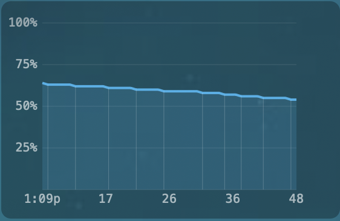

# BatteryGraph.spoon

A Hammerspoon Spoon that records and graphs battery percentage over time on your macOS desktop.



## Features

- **Live graph** — polls `hs.battery` every 60s and draws a scrolling line chart on the desktop
- **Change markers** — vertical lines at battery change events with auto-scaling density (`(changes/20)^1.3`)
- **Trim to discharge** — automatically cuts off previous charge cycles once the battery starts draining
- **Disk persistence** — survives restarts via `data.json`
- **Clear button** — click the "×" (twice within 2s) to reset all data
- **Demo mode** — synthetic test data with `demoData = true`
- **Configurable** — colors, sizes, position, polling interval, and more

## Installation

```lua
hs.loadSpoon("BatteryGraph")
spoon.BatteryGraph:start()
```

Or via SpoonInstall:

```lua
spoon.SpoonInstall:andUse("BatteryGraph", {
    repo = "DoozyDak/BatteryGraph.spoon",
    start = true,
})
```

## Usage

In your `~/.hammerspoon/init.lua`:

```lua
hs.loadSpoon("BatteryGraph")
spoon.BatteryGraph.rightMargin = 20
spoon.BatteryGraph:start()
```

## Configuration

| Property | Default | Description |
|---|---|---|
| `position` | `{ x = 20, y = 300 }` | Canvas position (ignored if `rightMargin` set) |
| `rightMargin` | `nil` | Distance from right edge (overrides `position.x`) |
| `windowLevel` | `nil` | `"desktopIcon"`, `"normal"`, etc. |
| `width` / `height` | `280` / `180` | Canvas size |
| `backgroundColor` | `{ alpha = 0.3, white = 0 }` | Background fill |
| `lineColor` | `{ red = 0.2, green = 0.7, blue = 1, alpha = 0.85 }` | Graph line color |
| `fillColor` | `{ red = 0.2, green = 0.7, blue = 1, alpha = 0.15 }` | Area fill under curve |
| `gridColor` | `{ white = 1, alpha = 0.12 }` | Grid line color |
| `textColor` | `{ white = 1, alpha = 0.6 }` | Label color |
| `fontSize` | `10` | Label font size |
| `pollInterval` | `60` | Seconds between battery readings |
| `maxHours` | `24` | Hours of history to keep |
| `demoData` | `false` | **@deprecated** — use synthetic test data |
| `trimToDischarge` | `true` | Show only current discharge cycle when battery is draining |

### Demo mode (deprecated)

```lua
spoon.BatteryGraph.demoData = true
spoon.BatteryGraph:start()
```

## Data Storage

Battery readings are stored in `~/.hammerspoon/Spoons/BatteryGraph.spoon/data.json` (excluded from git via `.gitignore`).

## License

MIT
